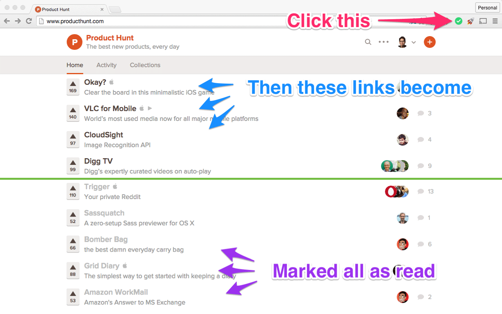
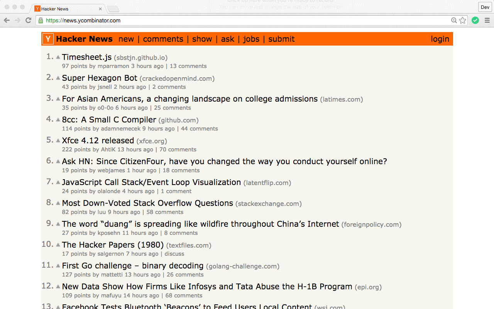
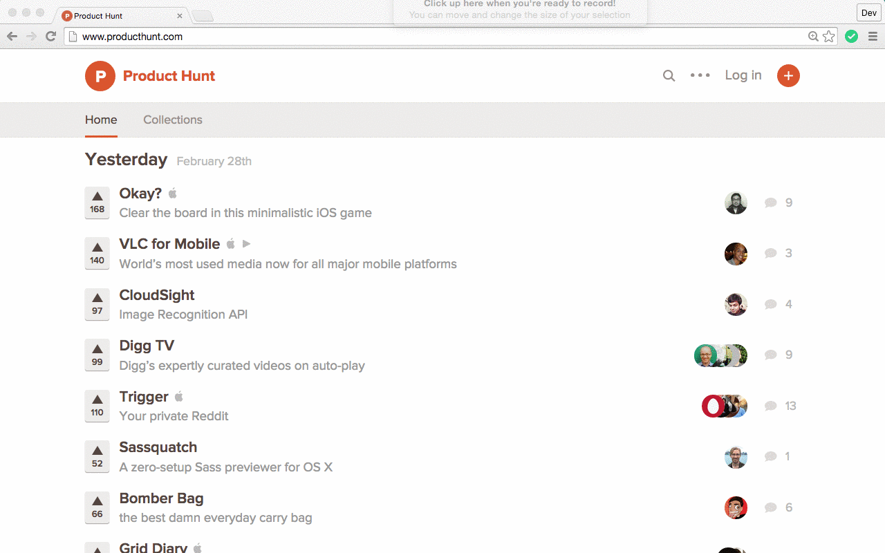
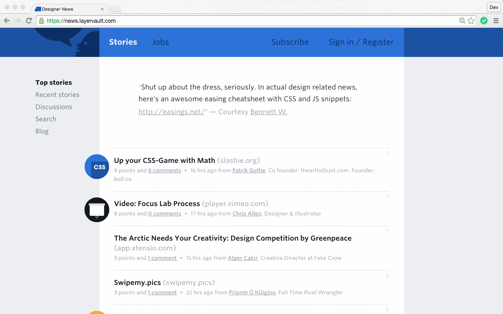
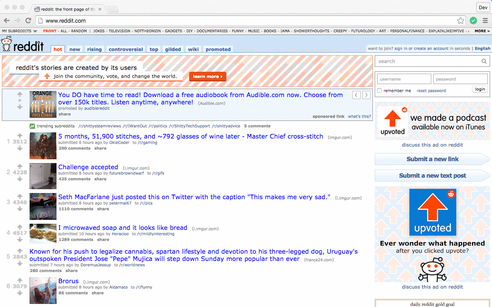

# Mark All as Read – Chrome Extension

One-click button to mark all the links on the page as read.

This turns all links to the `:visited` color so you know what you've seen before and didn't want to click on. Useful for Hacker News, Product Hunt, Designer News, and Reddit.

You can install this extension from the [Chrome Web Store](https://chrome.google.com/webstore/detail/mark-all-as-read/hocgdeifbnjnhhjiphmooojohmahocdl).

## Features

- Click the icon in the extensions bar once to mark all links as read
- Click again to mark all links as unread (there's a small lag)

## Notes

This extension naiively adds every single anchor tag to your Chrome history (this DOES NOT mean it clicks every link). The result is it can flood your Chrome history with lots of links.

## Examples

## License

Mark All as Read is licensed under the [MIT License](LICENSE).
